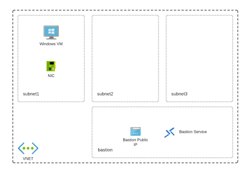

## Terraform Module Sample

This repo shows a basic sample of leveraging modules to organize Terraform code; in this case, the deployment of the following services:

* Network layer, comprised of a VNET and 4 subnets
* Azure Bastion service, which is deployed into one of the above subnets.
* Web Server vm, which is deployed in its' own subnet.

A diagram of this deployment is shown below:

Note this only is a demonstration of one possible way to decompose these deployment steps, but is being used to demonstrate leveraging Terraform modules to organize infrastructure code. 

### Known Issues

There is currently an error resulting from incorrect NSG rules being applied to the Bastion subnet. This will be fixed in upcoming iterations.